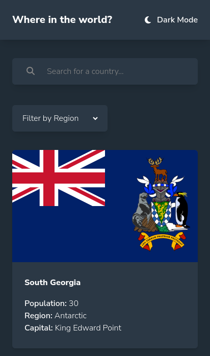
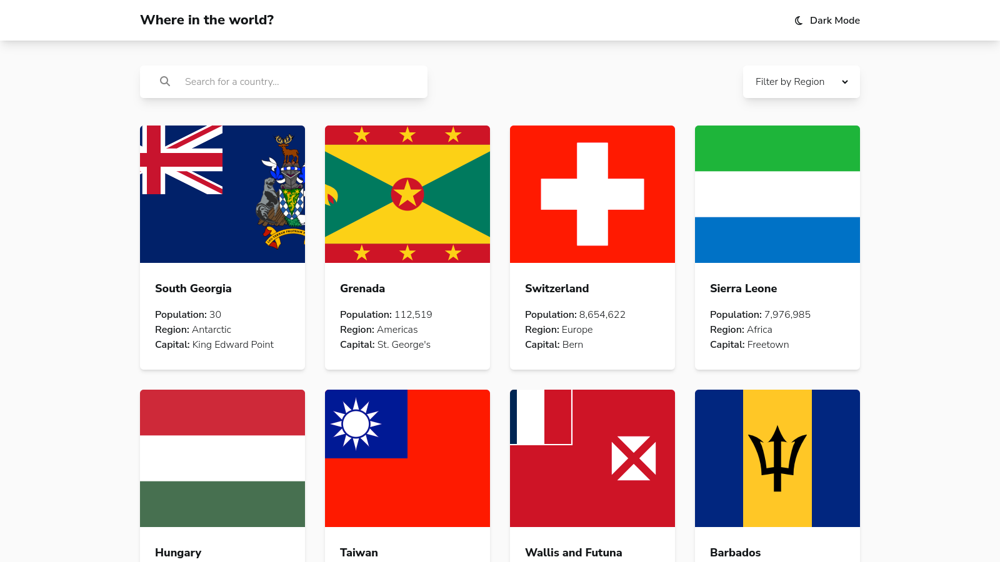
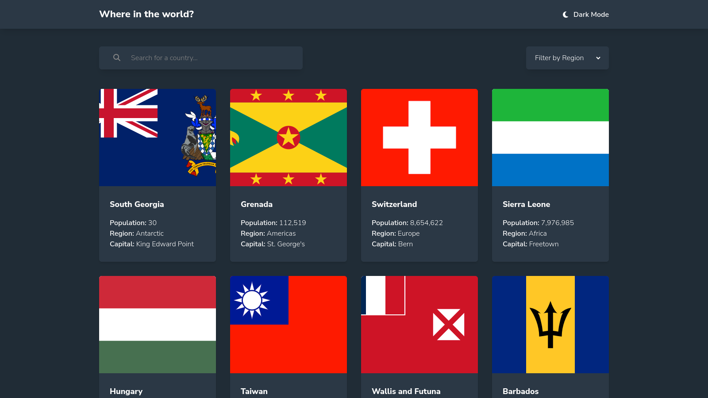
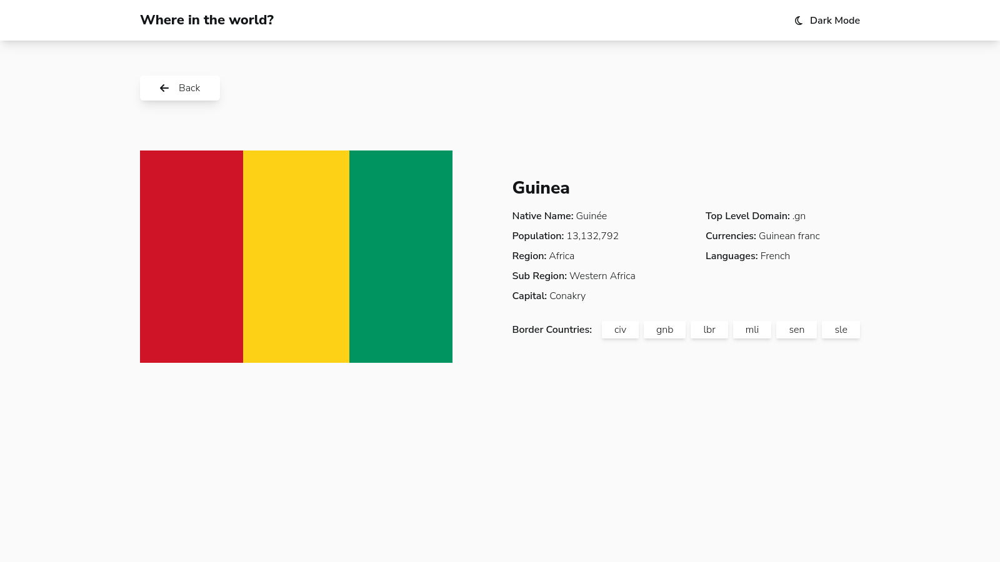
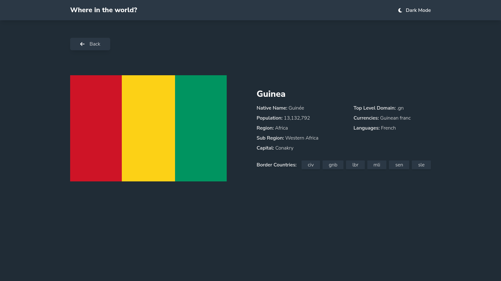
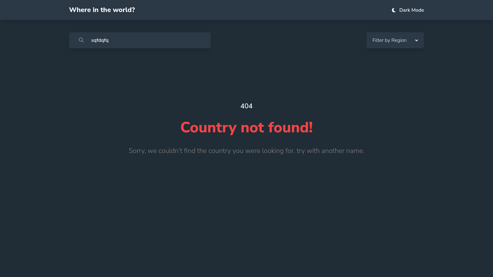
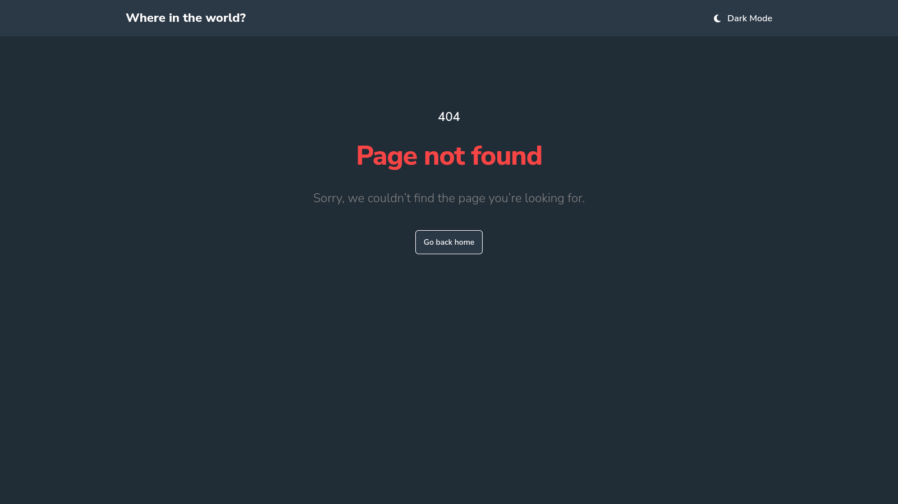

# Frontend Mentor - REST Countries API with color theme switcher solution


## Links

- Solution URL: [Add solution URL here](https://your-solution-url.com)
- Live Site Demo URL: [Add live site URL here](https://your-live-site-url.com)

## Welcome! 👋

Thanks for checking out this front-end coding challenge.

This is a solution to the [REST Countries API with color theme switcher challenge on Frontend Mentor](https://www.frontendmentor.io/challenges/rest-countries-api-with-color-theme-switcher-5cacc469fec04111f7b848ca).[Frontend Mentor](https://www.frontendmentor.io) challenges help you improve your coding skills by building realistic projects.

## Table of contents

- [The Challenge](#the-challenge)
- [Screenshots](#screenshots)
- [Built With](#built-with)
- [Useful resources](#useful-resources)
- [How To Use This Repos](#how-to-use-this-repos)
- [Author](#author)

### The challenge

Users should be able to:

- See all countries from the API on the homepage
- Search for a country using an `input` field
- Filter countries by region
- Click on a country to see more detailed information on a separate page
- Click through to the border countries on the detail page
- Toggle the color scheme between light and dark mode _(optional)_

## Screenshots

### Mobile



### Desktop Light



### Desktop Dark



### Desktop Detail Page Light



### Desktop Detail Page Dark



### Desktop Search Errors



### Desktop Detail Page Errors



## Built with

- Semantic HTML5 markup
- CSS custom properties
- Flexbox
- CSS Grid
- Mobile-first workflow
- [TailwindCSS](https://tailwindcss.com)
- [Vite Js](https://vitejs.dev/) - Javascript Bundler.
- [PNPM](https://pnpm.io/) - Package Manager.
- [React Js](https://react.dev/) - Javascript Framework.
- [Typescript](https://typescript) - A strongly typed language, builds on top of javascript.
- [Axios](https://axios-http.com/) - HTTP client for browser.
- [Zustand](https://zustand.docs.pmnd.rs/getting-started/introduction) - A small, fast, and scalable state management solution.

## Useful resources

The video from [Coding In Public](https://www.youtube.com/watch?v=cu8vs7rPOt0) on Youtube helped me a lot.

## How To Use This Repos

To clone and run this application, you'll need [Git](https://git-scm.com) and [PNPM](http://pnpm.io/) installed on your computer. From your command line:

```bash
# Clone this repository
$ git clone https://github.com/SouleymaneSy7/fem-rest-countries-api

# Install dependencies
$ pnpm install

# start the server
$ pnpm dev
```

## Author

- GitHub - [Souleymane Sy](https://github.com/SouleymaneSy7)
- Frontend Mentor - [@SouleymaneSy7](https://www.frontendmentor.io/profile/SouleymaneSy7)
- Dev Challenges - [Souleymane Sy](https://devchallenges.io/profile/534cd213-3165-4c16-bdcf-058e1f468da0)
- Twitter - [@Souleymanesy43](https://twitter.com/Souleymanesy43)
